<div align="center">



<p>
  <a href="https://www.linkedin.com/in/ayman-singh-333bab250/"></a>
  &nbsp;&nbsp;
  <a href="https://leetcode.com/u/AymanSingh6797/"></a>
  &nbsp;&nbsp;
  <a href="https://codeforces.com/profile/Ayman_Singh"></a>
  &nbsp;&nbsp;
  <a href="mailto:aymansingh09@gmail.com"></a>
</p>


</div>


##  About Me

**Final-year B.Tech (CSE) — IIT Jammu**

I build end-to-end ML systems and practical tools —
from experimentation and model training to production demos and systems-level tooling.
Focused on **computer vision**, **applied ML**, and **low-level networking (eBPF)**.

```
> focus_areas
├── Machine Learning & Computer Vision
│   └── experiments, model evaluation, dashboards
├── Systems & Networking
│   └── eBPF tooling, C/C++ utilities, data processing
└── Full Stack
    └── AI Agentic frameworks, web apps
```


##  Featured Projects

<div align="center">
<table width="100%">
<tr>
<td width="50%">

### Isolation Forest Anomaly IDS
Anomaly detection pipeline using Isolation Forest for network telemetry. Preprocessing, model training, evaluation dashboard.

**Open source contributions welcome!**

`python` `scikit-learn` `anomaly-detection`

[](https://github.com/Ayman-Singh/Isolation_Forest_Anomaly_IDS)

</td>
<td width="50%">

### LOWLIGHTEN Image Enhancement
Reimagining dark environment images as well-lit. Deep learning approach to low-light enhancement.

`python` `pytorch` `computer-vision`

[](https://github.com/Ayman-Singh/LOWLIGHTEN_IMAGE_ENHANCEMENT)

</td>
</tr>
<tr>
<td width="50%">

### AI-Interviewer
Gemini-based AI interviewer — Go backend, ReactJS frontend. Self-paced interview practice platform.

`go` `react` `gemini-api`

[](https://github.com/Ayman-Singh/AI-Interviewer)

</td>
<td width="50%">

### Nexus-Talk
WhatsApp clone — Go backend, ReactJS frontend. Real-time messaging with full chat features.

`go` `react` `websockets`

[](https://github.com/Ayman-Singh/nexus-talk)

</td>
</tr>
</table>
</div>


##  Tech Stack

<div align="center">

### Languages


### ML & Computer Vision


### Web & Tools


</div>


##  GitHub Stats

<div align="center">


</div>


##  Education

**B.Tech, Computer Science & Engineering** — IIT Jammu | Final Year | CGPA: 7.24

**Flipkart Grid 7.0** (2025) — National Semi-finalist · **Inter IIT Tech Meet 13.0** — 16th/23 IITs

**LeetCode Knight** (Top 5%) — 500+ problems


##  Connect

<div align="center">

[](https://github.com/Ayman-Singh)
[](https://linkedin.com/in/aymansingh09)
[](mailto:aymansingh09@gmail.com)

</div>



